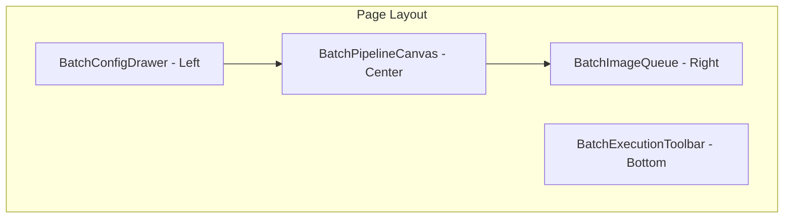
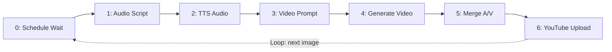
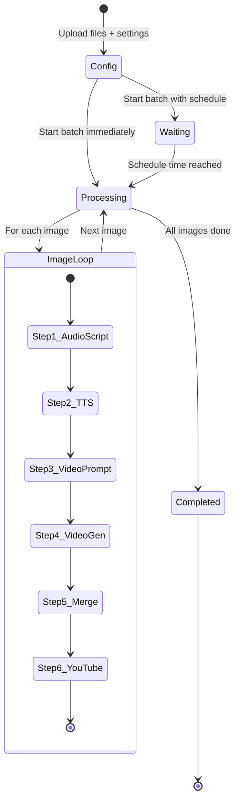

# Batch Pipeline Redesign - Architecture Plan

## Overview

Redesign the Batch Pipeline page to use a **visual pipeline canvas** (like Pipeline Workspace) with an additional **Schedule/Wait node**. The pipeline processes multiple images sequentially — when image 1 finishes all 7 steps, the nodes reset and run again for image 2, and so on.

## Current vs New Design

### Current Batch Pipeline
- Form-based upload with settings
- Creates a background job, polls for status
- Shows a simple progress bar with results list
- No visual pipeline canvas

### New Batch Pipeline
- Visual pipeline canvas with **7 nodes** (Schedule + 6 pipeline steps)
- Real-time SSE streaming showing each step's progress per image
- Image queue sidebar showing all uploaded images with their status
- Sequential execution: Image 1 → full pipeline → Image 2 → full pipeline → ...

---

## Architecture Diagram



## Pipeline Flow



## Batch Execution Lifecycle



---

## Backend Changes

### New Endpoint: `POST /batch-pipeline/stream`

A new SSE streaming endpoint that processes batch items sequentially and emits real-time events for each step of each image.

**SSE Event Format:**
```json
{
  "step": 0,
  "status": "schedule_wait",
  "label": "Waiting for schedule",
  "data": {
    "scheduled_for": "2026-03-01T18:00:00",
    "remaining_seconds": 3600
  },
  "image_index": 0,
  "image_name": "",
  "total_images": 5
}
```

```json
{
  "step": 1,
  "status": "running",
  "label": "Generate Audio Script",
  "data": null,
  "image_index": 1,
  "image_name": "product1",
  "total_images": 5
}
```

```json
{
  "step": 0,
  "status": "image_done",
  "label": "Image Complete",
  "data": {
    "final_path": "/path/to/output.mp4",
    "youtube_url": "https://..."
  },
  "image_index": 1,
  "image_name": "product1",
  "total_images": 5
}
```

```json
{
  "step": 0,
  "status": "batch_done",
  "label": "Batch Complete",
  "data": {
    "success_count": 4,
    "fail_count": 1,
    "results": [...]
  },
  "image_index": 5,
  "image_name": "",
  "total_images": 5
}
```

**Key SSE statuses:**
- `schedule_wait` — Node 0 is waiting for scheduled time
- `schedule_tick` — Periodic tick during schedule wait (e.g. every 10s)
- `running` — Step is currently executing
- `completed` — Step finished successfully
- `error` — Step failed
- `skipped` — Step was skipped (e.g. YouTube when disabled)
- `image_done` — All steps for current image complete, transitioning to next
- `batch_done` — All images processed

### Modified `_sse_event` helper

```python
def _batch_sse_event(step, status, label, data=None, image_index=0, image_name="", total_images=0):
    payload = {
        "step": step,
        "status": status,
        "label": label,
        "data": data,
        "image_index": image_index,
        "image_name": image_name,
        "total_images": total_images,
    }
    return f"data: {json.dumps(payload)}\n\n"
```

### Endpoint Implementation Pattern

```python
@app.post("/batch-pipeline/stream")
async def batch_pipeline_stream(
    files: List[UploadFile],
    # ... same params as current batch-pipeline ...
    schedule_time: Optional[str] = Form(None),
    delay_between: int = Form(0),
):
    # Save files to temp dir, find pairs
    # Return StreamingResponse with event_generator
    
    def event_generator():
        # Step 0: Schedule Wait
        if schedule_time:
            yield _batch_sse_event(0, "schedule_wait", ...)
            # Wait loop with periodic ticks
            while not_yet_time:
                yield _batch_sse_event(0, "schedule_tick", ...)
                time.sleep(10)
        yield _batch_sse_event(0, "completed", "Schedule Ready")
        
        # Process each image
        for i, pair in enumerate(pairs, 1):
            yield _batch_sse_event(0, "image_start", ..., image_index=i)
            
            # Steps 1-6 (same as pipeline/stream but with image_index)
            yield _batch_sse_event(1, "running", ..., image_index=i)
            # ... process step ...
            yield _batch_sse_event(1, "completed", ..., image_index=i)
            # ... repeat for steps 2-6 ...
            
            yield _batch_sse_event(0, "image_done", ..., image_index=i)
            
            # Delay between images
            if delay_between > 0 and i < total:
                time.sleep(delay_between)
        
        yield _batch_sse_event(0, "batch_done", ...)
```

---

## Frontend Changes

### 1. Types (`types/index.ts`)

```typescript
// Extended SSE event for batch
export interface BatchSSEEvent {
  step: number;
  status: string;
  label: string;
  data: Record<string, unknown> | null;
  image_index: number;
  image_name: string;
  total_images: number;
}

// Result for each completed image in batch
export interface BatchImageResult {
  index: number;
  name: string;
  status: 'success' | 'error' | 'pending' | 'processing';
  final_path?: string;
  youtube_url?: string;
  audio_script?: string;
  error?: string;
}
```

### 2. Constants (`utils/constants.ts`)

Add 7-node layout (Schedule node + 6 pipeline nodes) in a snake/zigzag pattern:

```
Row 1: [Schedule] → [Audio Script] → [TTS Audio] → [Video Prompt]
Row 2:                                [YouTube] ← [Merge] ← [Video Gen]
```

```typescript
export const BATCH_PIPELINE_STEPS: PipelineStep[] = [
  { step: 0, label: 'Schedule', sublabel: 'Wait/Timer', icon: 'clock', status: 'idle' },
  { step: 1, label: 'Audio Script', sublabel: 'Groq LLM', icon: 'brain', status: 'idle' },
  { step: 2, label: 'TTS Audio', sublabel: 'Edge TTS', icon: 'mic', status: 'idle' },
  { step: 3, label: 'Video Prompt', sublabel: 'Groq LLM', icon: 'sparkles', status: 'idle' },
  { step: 4, label: 'Generate Video', sublabel: 'ComfyUI', icon: 'film', status: 'idle' },
  { step: 5, label: 'Merge A/V', sublabel: 'ffmpeg', icon: 'merge', status: 'idle' },
  { step: 6, label: 'YouTube Upload', sublabel: 'YouTube API', icon: 'upload', status: 'idle' },
];

export const BATCH_CANVAS_NODE_POSITIONS: Record<number, { x: number; y: number }> = {
  0: { x: 50, y: 180 },    // Schedule - left center
  1: { x: 300, y: 80 },    // Audio Script
  2: { x: 550, y: 80 },    // TTS
  3: { x: 800, y: 80 },    // Video Prompt
  4: { x: 800, y: 280 },   // Video Gen
  5: { x: 550, y: 280 },   // Merge
  6: { x: 300, y: 280 },   // YouTube
};

export const BATCH_CANVAS_EDGES = [
  { id: 'e0-1', source: '0', target: '1' },
  { id: 'e1-2', source: '1', target: '2' },
  { id: 'e2-3', source: '2', target: '3' },
  { id: 'e3-4', source: '3', target: '4' },
  { id: 'e4-5', source: '4', target: '5' },
  { id: 'e5-6', source: '5', target: '6' },
];
```

### 3. API (`api/batch.ts`)

Add new function for SSE batch streaming:

```typescript
export function startBatchPipelineStream(
  formData: FormData,
  onEvent: (event: BatchSSEEvent) => void,
  onError: (error: string) => void,
  onComplete: () => void
): AbortController { ... }
```

### 4. Hook: `useBatchPipelineExecution`

**State managed:**
- `steps: PipelineStep[]` — Current 7-node state (reset per image)
- `currentImageIndex: number` — Which image is being processed (1-based)
- `totalImages: number` — Total images in batch
- `currentImageName: string` — Name of current image
- `imageResults: BatchImageResult[]` — Accumulated results
- `isRunning: boolean`
- `isScheduleWaiting: boolean`
- `scheduleRemaining: number` — Seconds remaining for schedule
- `batchStatus: 'idle' | 'waiting' | 'running' | 'completed' | 'error'`
- `error: string | null`

**Key behaviors:**
- On `schedule_wait`/`schedule_tick` → Update schedule node (step 0) with countdown
- On `image_start` → Reset all pipeline nodes (1-6) to pending, update currentImageIndex
- On step `running`/`completed`/`error` → Update corresponding node
- On `image_done` → Add result to imageResults, mark current image as success/error
- On `batch_done` → Set batchStatus to completed

### 5. Component: `BatchPipelineCanvas`

Reuses `PipelineCanvas` approach but with 7 nodes:
- Uses `BATCH_CANVAS_NODE_POSITIONS` and `BATCH_CANVAS_EDGES`
- Step 0 node has a special "clock" icon and schedule-specific styling
- The Schedule node shows countdown timer when waiting
- A **loop indicator** visual (dashed arrow from node 6 back to node 0) appears when there are more images
- Reuses existing `PipelineStepNode` component (add 'clock' to icon map)
- Reuses existing `AnimatedEdge` component

### 6. Component: `BatchConfigDrawer`

Left panel (similar to ConfigDrawer) containing:
- **File Upload** — Reuses `BatchFileUpload` for image+txt pairs
- **Pipeline Settings** — Voice, Background Music, Duration, BG Volume
- **Schedule Settings** — Schedule Time, Delay Between Items  
- **YouTube Settings** — Upload toggle + privacy
- **Advanced** — Resolution, Steps, CFG
- **Start Button** — "Start Batch (N items)"

### 7. Component: `BatchExecutionToolbar`

Bottom toolbar showing:
- **Batch progress**: "Image 2/5 — product2"
- **Overall progress bar**: Based on completed images / total
- **Current step indicator**: "Step 3: Video Prompt"
- **Stop/Cancel button**
- **Reset button** (when done)

### 8. Component: `BatchImageQueue`

Right panel showing image queue:
- Scrollable list of all uploaded images
- Each item shows: thumbnail, name, status badge
- Status: pending / processing / success / error
- Currently processing image is highlighted
- Completed images show small result preview or download link

### 9. Page: `BatchPipeline.tsx` Redesign

```
┌──────────────────────────────────────────────────────────┐
│ [Header: Batch Pipeline]                                  │
├────────┬─────────────────────────────────┬───────────────┤
│        │                                 │               │
│ Config │      Pipeline Canvas            │  Image Queue  │
│ Drawer │   [Schedule] → [1] → [2] → [3] │  ┌─────────┐  │
│        │                [6] ← [5] ← [4] │  │ img1 ✓  │  │
│ Upload │                                 │  │ img2 ⏳  │  │
│ Voice  │     "Processing: product2"      │  │ img3 ○  │  │
│ Music  │     "Image 2 of 5"              │  │ img4 ○  │  │
│ Sched  │                                 │  │ img5 ○  │  │
│        │                                 │  └─────────┘  │
├────────┴─────────────────────────────────┴───────────────┤
│ [Toolbar: ■ Image 2/5 ━━━━━━━━━━░░░░░  Stop | Reset]    │
└──────────────────────────────────────────────────────────┘
```

**States:**
1. **Config State** — Config drawer open, no execution, image queue hidden
2. **Running State** — Config drawer closed, canvas active, image queue visible on right
3. **Completed State** — Canvas shows final state, results available

---

## File Changes Summary

### Backend (Python)
| File | Action | Description |
|------|--------|-------------|
| `main.py` | Modify | Add `POST /batch-pipeline/stream` SSE endpoint |
| `main.py` | Modify | Add `_batch_sse_event()` helper function |

### Frontend (TypeScript/React)
| File | Action | Description |
|------|--------|-------------|
| `types/index.ts` | Modify | Add `BatchSSEEvent`, `BatchImageResult` types |
| `utils/constants.ts` | Modify | Add `BATCH_PIPELINE_STEPS`, `BATCH_CANVAS_NODE_POSITIONS`, `BATCH_CANVAS_EDGES` |
| `api/batch.ts` | Modify | Add `startBatchPipelineStream()` SSE function |
| `hooks/useBatchPipelineExecution.ts` | Create | New hook for batch pipeline with SSE |
| `components/canvas/PipelineStepNode.tsx` | Modify | Add 'clock' icon to `iconMap` |
| `components/batch/BatchPipelineCanvas.tsx` | Create | Canvas with 7 nodes for batch |
| `components/batch/BatchConfigDrawer.tsx` | Create | Config drawer with file upload + settings |
| `components/batch/BatchExecutionToolbar.tsx` | Create | Bottom toolbar with batch progress |
| `components/batch/BatchImageQueue.tsx` | Create | Right sidebar with image list |
| `pages/BatchPipeline.tsx` | Rewrite | Full redesign with canvas layout |

### Files to Keep (reused as-is)
- `components/canvas/AnimatedEdge.tsx` — Reused for edge animations
- `components/canvas/PipelineStepNode.tsx` — Reused for node rendering (minor mod)
- `components/canvas/NodeDetailPopover.tsx` — Reused for clicking completed nodes
- `components/shared/*` — All shared components reused
- `components/batch/BatchFileUpload.tsx` — Reused in BatchConfigDrawer
- `components/results/ResultPanel.tsx` — Can be reused for per-image results

### Files Removed/Deprecated
- `components/batch/BatchPairsTable.tsx` — No longer needed (replaced by BatchImageQueue)
- `components/batch/BatchProgress.tsx` — Replaced by BatchExecutionToolbar
- `components/batch/ScheduleConfig.tsx` — Integrated into BatchConfigDrawer
- `components/batch/BatchItemCard.tsx` — Replaced by BatchImageQueue items
- `hooks/useBatchPolling.ts` — Replaced by SSE-based hook (kept for Jobs page)
