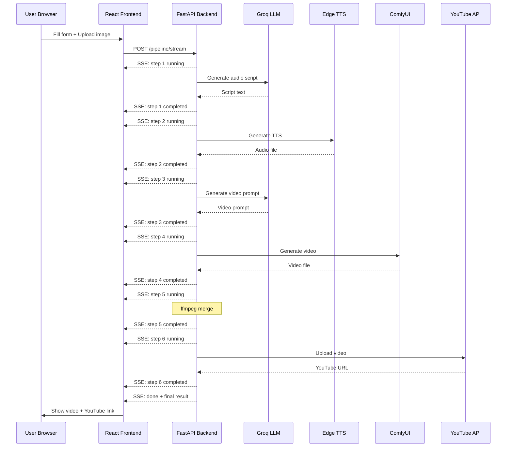
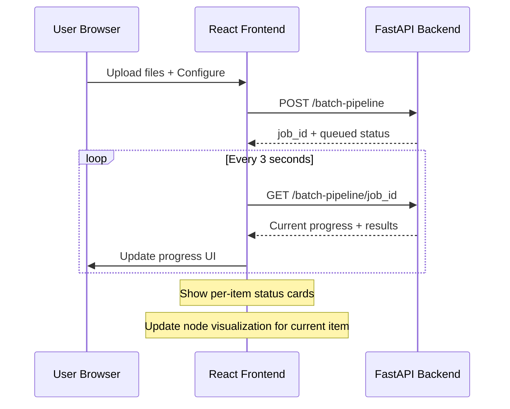

# Frontend Architecture Plan — Video Pipeline React UI

## Overview

Build a modern, luxurious, and minimal React frontend for the video production pipeline. The UI will allow users to create videos automatically from images + descriptions, upload to YouTube on schedule, and visualize the step-by-step pipeline progress in an **n8n-style node workflow**.

---

## Backend API Summary

### Existing Endpoints (from `main.py`)

| Method | Endpoint | Description |
|--------|----------|-------------|
| `GET` | `/` | Health check |
| `GET` | `/backgrounds` | List background music files |
| `POST` | `/tts/edge-groq` | Generate TTS audio from prompt |
| `POST` | `/merge` | Merge video + audio + optional background |
| `POST` | `/pipeline` | Run full pipeline (single image → video) |
| `POST` | `/batch-pipeline` | Start batch pipeline job (multiple images) |
| `GET` | `/batch-pipeline/{job_id}` | Get batch job status/progress |
| `GET` | `/batch-pipeline` | List all batch jobs |

### Pipeline Steps (6 nodes to visualize)

```
1. Generate Audio Script (Groq LLM)
       ↓
2. Generate TTS Audio (Edge TTS)
       ↓
3. Generate Video Prompt (Groq LLM)
       ↓
4. Generate Video (ComfyUI Wan2.2)
       ↓
5. Merge Video + Audio (ffmpeg)
       ↓
6. Upload to YouTube (optional)
```

### New Backend Endpoints Needed

| Method | Endpoint | Description |
|--------|----------|-------------|
| `POST` | `/pipeline/stream` | SSE endpoint - runs pipeline with real-time step progress |
| `GET` | `/voices` | List available TTS voices |

The `/pipeline/stream` endpoint will use **Server-Sent Events (SSE)** to stream progress updates like:

```json
{"step": 1, "status": "running", "label": "Generate Audio Script", "data": null}
{"step": 1, "status": "completed", "label": "Generate Audio Script", "data": {"script": "..."}}
{"step": 2, "status": "running", "label": "Generate TTS Audio", "data": null}
...
{"step": 6, "status": "completed", "label": "Upload to YouTube", "data": {"youtube_url": "..."}}
{"step": "done", "status": "completed", "data": {"final_path": "...", "youtube_url": "..."}}
```

---

## Tech Stack

| Layer | Technology |
|-------|-----------|
| Build Tool | Vite |
| Framework | React 18+ |
| Language | TypeScript |
| Styling | Tailwind CSS |
| Icons | Lucide React |
| HTTP Client | Axios |
| State Management | React hooks (useState, useReducer, useContext) |
| SSE Client | Native EventSource / fetch streaming |
| Routing | React Router v6 |
| Animations | Framer Motion |

---

## Design System

### Theme: Dark Luxury Minimal

- **Background**: `#0a0a0f` (near-black) with subtle gradient
- **Surface**: `#13131a` cards with `#1a1a25` borders
- **Accent Primary**: `#8b5cf6` (violet/purple)
- **Accent Secondary**: `#06b6d4` (cyan)
- **Success**: `#10b981` (emerald)
- **Warning**: `#f59e0b` (amber)
- **Error**: `#ef4444` (red)
- **Text Primary**: `#f1f5f9`
- **Text Secondary**: `#94a3b8`
- **Font**: Inter / System UI

### Design Principles
- **No excessive whitespace** — compact, information-dense layout
- **Glass morphism** effects on cards (backdrop-blur)
- **Subtle gradients** and glow effects on active elements
- **Smooth transitions** between states using Framer Motion
- **Responsive** but optimized for desktop-first workflow

---

## Page Structure

### Layout

```
┌─────────────────────────────────────────────────┐
│  Sidebar (collapsed icon nav)  │   Main Content  │
│  ┌───┐                         │                  │
│  │ 🎬│  Single Pipeline        │   [Active Page]  │
│  │ 📦│  Batch Pipeline         │                  │
│  │ 📊│  Jobs Dashboard         │                  │
│  │ ⚙️│  Settings               │                  │
│  └───┘                         │                  │
└─────────────────────────────────────────────────┘
```

### Page 1: Single Pipeline (`/`)

The main creative workspace. Split into two columns:

**Left Column — Configuration Panel**
- Image upload (drag & drop with preview)
- Product description textarea
- Duration slider (3-30s)
- Voice selector dropdown
- Background music selector (with preview play button)
- Background volume slider
- Advanced settings accordion:
  - Resolution (width × height)
  - ComfyUI steps
  - CFG scale
  - Custom audio script override
  - Custom video prompt override
- YouTube upload toggle
  - Privacy selector (public/private/unlisted)
- **Run Pipeline** button (large, prominent)

**Right Column — Pipeline Progress & Results**
- **n8n-style Node Flow Visualizer** (vertical)
  - 6 nodes connected by lines
  - States: `idle` → `running` (animated pulse/glow) → `completed` (green check) → `error` (red X)
  - Each node shows its label and expandable details when completed
  - Running node has animated border glow
- Result section:
  - Video player (when ready)
  - Audio player
  - Generated scripts (expandable)
  - YouTube link (if uploaded)
  - Download button

### Page 2: Batch Pipeline (`/batch`)

**Top Section — Configuration**
- Multi-file upload zone (drag & drop images + txt pairs)
- Uploaded pairs preview table showing: thumbnail, filename, description preview
- Same parameter controls as single pipeline (shared component)
- Schedule settings:
  - Schedule time picker (HH:MM)
  - Delay between items (seconds)
- **Start Batch** button

**Bottom Section — Batch Progress**
- Overall progress bar with count (3/10 completed)
- Per-item progress cards, each containing:
  - Mini node-flow showing which step the current item is on
  - Item name, status badge, duration, YouTube link
- Live log output (scrollable, auto-scroll)

### Page 3: Jobs Dashboard (`/jobs`)

- Table/grid of all batch jobs
- Columns: Job ID, Status, Progress (x/total), Created, Completed, Actions
- Click to expand → shows detailed results per item
- Status badges: queued, scheduled, running, completed, failed
- Auto-refresh every 5 seconds for running jobs

---

## Component Architecture

```
frontend/
├── public/
│   └── favicon.svg
├── src/
│   ├── main.tsx
│   ├── App.tsx
│   ├── index.css                    (Tailwind imports + custom styles)
│   ├── api/
│   │   ├── client.ts                (Axios instance, base URL config)
│   │   ├── pipeline.ts              (pipeline API calls)
│   │   ├── batch.ts                 (batch pipeline API calls)
│   │   ├── backgrounds.ts           (background music API)
│   │   └── sse.ts                   (SSE helper for streaming progress)
│   ├── components/
│   │   ├── layout/
│   │   │   ├── Sidebar.tsx
│   │   │   ├── MainLayout.tsx
│   │   │   └── PageHeader.tsx
│   │   ├── pipeline/
│   │   │   ├── NodeFlowVisualizer.tsx    (n8n-style step nodes)
│   │   │   ├── PipelineNode.tsx          (single node component)
│   │   │   ├── NodeConnector.tsx         (line between nodes)
│   │   │   ├── PipelineForm.tsx          (config form - shared)
│   │   │   ├── ImageUpload.tsx           (drag & drop image upload)
│   │   │   └── PipelineResult.tsx        (video/audio player + results)
│   │   ├── batch/
│   │   │   ├── BatchFileUpload.tsx       (multi-file upload)
│   │   │   ├── BatchPairsTable.tsx       (preview uploaded pairs)
│   │   │   ├── BatchProgress.tsx         (overall batch progress)
│   │   │   ├── BatchItemCard.tsx         (per-item progress card)
│   │   │   └── ScheduleConfig.tsx        (time picker + delay)
│   │   ├── shared/
│   │   │   ├── VoiceSelector.tsx
│   │   │   ├── BackgroundMusicSelector.tsx
│   │   │   ├── VideoPlayer.tsx
│   │   │   ├── AudioPlayer.tsx
│   │   │   ├── StatusBadge.tsx
│   │   │   ├── GlowButton.tsx
│   │   │   └── ExpandableSection.tsx
│   │   └── jobs/
│   │       ├── JobsTable.tsx
│   │       └── JobDetailPanel.tsx
│   ├── pages/
│   │   ├── SinglePipeline.tsx
│   │   ├── BatchPipeline.tsx
│   │   └── JobsDashboard.tsx
│   ├── hooks/
│   │   ├── usePipelineSSE.ts        (SSE connection hook)
│   │   ├── useBatchPolling.ts       (polling for batch status)
│   │   └── useBackgrounds.ts        (fetch background music list)
│   ├── types/
│   │   └── index.ts                 (TypeScript interfaces)
│   └── utils/
│       └── constants.ts             (API base URL, step labels, etc.)
├── tailwind.config.js
├── postcss.config.js
├── tsconfig.json
├── vite.config.ts
├── package.json
└── index.html
```

---

## Node Flow Visualizer Design (n8n-style)

```
  ┌──────────────────────────────────┐
  │  1  Generate Audio Script        │  ← idle: gray border, muted
  │     Groq LLM                     │  ← running: violet glow pulse
  │     ✓ 156 chars generated        │  ← completed: green border + check
  └──────────────────────────────────┘
           │ (animated dots when active)
           ▼
  ┌──────────────────────────────────┐
  │  2  Generate TTS Audio           │
  │     Edge TTS                     │
  │     🔊 5.2s audio                │
  └──────────────────────────────────┘
           │
           ▼
  ┌──────────────────────────────────┐
  │  3  Generate Video Prompt        │
  │     Groq LLM                     │
  └──────────────────────────────────┘
           │
           ▼
  ┌──────────────────────────────────┐
  │  4  Generate Video               │  ← This step takes longest
  │     ComfyUI Wan2.2               │  ← Show spinner + elapsed time
  └──────────────────────────────────┘
           │
           ▼
  ┌──────────────────────────────────┐
  │  5  Merge Video + Audio          │
  │     ffmpeg                       │
  └──────────────────────────────────┘
           │
           ▼
  ┌──────────────────────────────────┐
  │  6  Upload to YouTube            │
  │     YouTube API                  │
  └──────────────────────────────────┘
```

### Node States & Styling

| State | Border | Background | Icon | Animation |
|-------|--------|------------|------|-----------|
| `idle` | `border-slate-700` | `bg-slate-900/50` | Number (dim) | None |
| `pending` | `border-slate-600` | `bg-slate-800/50` | Number | None |
| `running` | `border-violet-500` | `bg-violet-950/30` | Spinner | Pulse glow shadow |
| `completed` | `border-emerald-500` | `bg-emerald-950/20` | ✓ Checkmark | Brief flash |
| `error` | `border-red-500` | `bg-red-950/20` | ✗ X mark | Shake |
| `skipped` | `border-slate-600` | `bg-slate-900/30` | – Dash | None |

### Connector Line Animation
- Idle: Dashed gray line
- Active: Animated flowing dots (CSS animation) in violet
- Completed: Solid green line

---

## Backend Modifications Required

### 1. New SSE Pipeline Endpoint

Add to `main.py` a new `/pipeline/stream` endpoint that wraps `run_pipeline` but yields SSE events at each step:

```python
from fastapi.responses import StreamingResponse

@app.post("/pipeline/stream")
async def run_pipeline_stream(...):
    async def event_generator():
        # Step 1: Audio Script
        yield sse_event(step=1, status="running")
        script = generate_audio_prompt(...)
        yield sse_event(step=1, status="completed", data={"script": script})
        
        # Step 2: TTS Audio
        yield sse_event(step=2, status="running")
        audio_path = generate_tts_audio(...)
        yield sse_event(step=2, status="completed", data={"audio_path": audio_path})
        
        # ... etc for all 6 steps
        
    return StreamingResponse(event_generator(), media_type="text/event-stream")
```

### 2. Voices Endpoint

```python
@app.get("/voices")
async def get_voices():
    return {"voices": list(EDGE_VOICES.keys())}
```

### 3. Serve Static Files (Optional)

For production, serve the built React frontend from FastAPI:

```python
from fastapi.staticfiles import StaticFiles
app.mount("/", StaticFiles(directory="frontend/dist", html=True))
```

---

## Data Flow Diagram



---

## Batch Pipeline Flow



---

## Implementation Order

1. **Backend SSE endpoint** — Add `/pipeline/stream` with step-by-step SSE events
2. **Frontend scaffold** — Vite + React + TS + Tailwind + Router
3. **Layout & Theme** — Sidebar, dark theme, glassmorphism cards
4. **Node Flow Visualizer** — The core visual component
5. **Single Pipeline Page** — Form + node visualizer + results
6. **Batch Pipeline Page** — Multi-upload + batch progress
7. **Jobs Dashboard** — List + detail view
8. **Polish** — Animations, transitions, responsive tweaks
