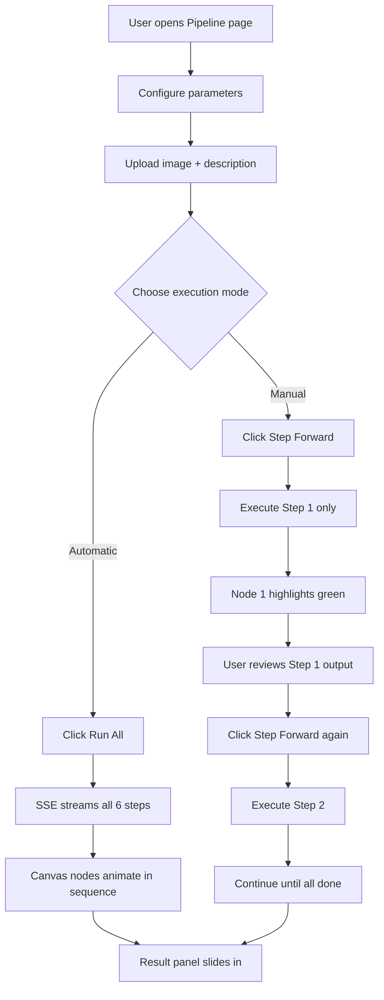
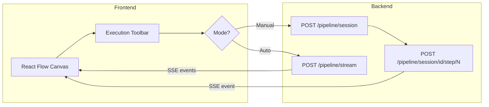
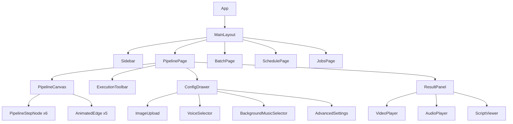

# Redesign Plan — Modern n8n-Style Pipeline UI

## Overview

Redesign the entire frontend to deliver a modern, n8n-style visual workflow experience. Users can:
- **See pipeline nodes on a 2D canvas** with animated connections
- **Watch nodes highlight in real-time** as each step executes
- **Run manually step-by-step** — clicking "Execute Next" to advance one node at a time
- **Run automatically** — all steps execute sequentially with live progress
- **Create and manage schedules** for batch pipeline runs

---

## Current State Analysis

### What Exists

| Component | Status |
|-----------|--------|
| Backend SSE streaming `/pipeline/stream` | ✅ Working — streams 6 steps |
| Backend step functions are individually callable | ✅ Available as imports |
| Frontend vertical node list | ⚠️ Basic — not canvas-based |
| Manual step-by-step execution | ❌ Not implemented |
| Schedule management UI | ❌ Not implemented |
| React Flow or canvas library | ❌ Not installed |

### Pipeline Steps (6 Nodes)

```
┌─────────────────────┐     ┌─────────────────────┐     ┌──────────────────────┐
│  1. Audio Script    │────▶│  2. TTS Audio       │────▶│  3. Video Prompt     │
│     Groq LLM        │     │     Edge TTS         │     │     Groq LLM         │
└─────────────────────┘     └─────────────────────┘     └──────────────────────┘
                                                                  │
         ┌────────────────────────────────────────────────────────┘
         ▼
┌─────────────────────┐     ┌─────────────────────┐     ┌──────────────────────┐
│  4. Generate Video  │────▶│  5. Merge A/V       │────▶│  6. YouTube Upload   │
│     ComfyUI Wan2.2   │     │     ffmpeg           │     │     YouTube API       │
└─────────────────────┘     └─────────────────────┘     └──────────────────────┘
```

---

## Architecture Changes

### Backend Changes

#### New Endpoints for Step-by-Step Execution

The current `/pipeline/stream` runs all steps in sequence. For manual step-by-step control, we need new endpoints:

| Method | Endpoint | Description |
|--------|----------|-------------|
| `POST` | `/pipeline/session` | Create a new pipeline session, return `session_id` |
| `POST` | `/pipeline/session/{id}/step/{step_num}` | Execute a single step in the session |
| `GET` | `/pipeline/session/{id}` | Get current session state and all step results |
| `DELETE` | `/pipeline/session/{id}` | Cancel/delete a session |

**Session Model:**

```python
pipeline_sessions = {}  # In-memory store

# Session structure:
{
    "session_id": "abc123",
    "status": "created",  # created | running | paused | completed | error
    "mode": "manual",     # manual | auto
    "image_path": "/tmp/...",
    "config": { ... },    # All pipeline parameters
    "current_step": 0,    # Last completed step
    "steps": {
        1: {"status": "idle", "result": None},
        2: {"status": "idle", "result": None},
        ...
        6: {"status": "idle", "result": None},
    },
    "created_at": "...",
}
```

**Step Execution Flow (Manual Mode):**

```
POST /pipeline/session          → Creates session, uploads image
                                  Returns: { session_id, steps: [...] }

POST /pipeline/session/{id}/step/1  → Runs step 1 only
                                      Returns SSE stream for that single step

POST /pipeline/session/{id}/step/2  → Runs step 2 only
                                      Returns SSE stream for that single step
...and so on
```

Each step endpoint validates that the previous step is completed before executing.

#### Schedule Management Endpoints

| Method | Endpoint | Description |
|--------|----------|-------------|
| `GET` | `/schedules` | List all scheduled pipelines |
| `POST` | `/schedules` | Create a new scheduled pipeline run |
| `DELETE` | `/schedules/{id}` | Cancel a scheduled pipeline |
| `GET` | `/schedules/{id}` | Get schedule details and execution status |

---

### Frontend Changes

#### New Dependency: React Flow

Install `@xyflow/react` (formerly `reactflow`) — the industry-standard library for building node-based editors and workflow visualizers in React.

```bash
npm install @xyflow/react
```

#### New Page Structure

```
┌──────────────────────────────────────────────────────────────────┐
│  Sidebar          │                Main Content                   │
│  ┌────┐           │                                               │
│  │ 🎬 │  Pipeline │  ┌─────────────────────────────────────────┐ │
│  │ 📦 │  Batch    │  │        Node Canvas (React Flow)          │ │
│  │ 📅 │  Schedule │  │                                          │ │
│  │ 📊 │  Jobs     │  │   [Node 1]──▶[Node 2]──▶[Node 3]       │ │
│  │ ⚙️ │  Settings │  │                            │              │ │
│  └────┘           │  │   [Node 4]──▶[Node 5]──▶[Node 6]       │ │
│                   │  │                                          │ │
│                   │  └─────────────────────────────────────────┘ │
│                   │                                               │
│                   │  ┌──────────────┐  ┌──────────────────────┐  │
│                   │  │ Config Panel │  │   Result Panel       │  │
│                   │  │ (Collapsible)│  │   (Slides in)        │  │
│                   │  └──────────────┘  └──────────────────────┘  │
└──────────────────────────────────────────────────────────────────┘
```

---

## Detailed Component Design

### 1. Pipeline Canvas — Node Workflow Visualizer

**Layout:** 2-row, 3-column grid on a canvas with pan/zoom.

```
Row 1:  [Audio Script] ──edge──▶ [TTS Audio] ──edge──▶ [Video Prompt]
                                                              │
                                                          edge│
                                                              ▼
Row 2:                  [YouTube] ◀──edge── [Merge] ◀──edge── [Generate Video]
```

**Node Design (Custom React Flow Node):**

Each node is a card approximately 200x100px with:
- Icon representing the service (brain icon for LLM, mic for TTS, video for ComfyUI, etc.)
- Step label
- Sublabel (technology name)
- Status indicator (color-coded border + icon)
- Elapsed time when running/completed
- Click to expand: shows step output data

**Node States & Visual Treatment:**

| State | Border | Background | Icon | Animation |
|-------|--------|------------|------|-----------|
| `idle` | `slate-700` | `slate-900/50` | Step number | None |
| `pending` | `slate-600` | `slate-800/50` | Step number | Subtle pulse |
| `running` | `violet-500` | `violet-950/30` | Spinner | Glow pulse + animated border |
| `completed` | `emerald-500` | `emerald-950/20` | Checkmark | Success flash |
| `error` | `red-500` | `red-950/20` | X mark | Shake |
| `skipped` | `slate-600` | `slate-900/30` | Minus | None |

**Edge (Connection) Animations:**

| Condition | Style |
|-----------|-------|
| Both nodes idle | Dashed gray line |
| Source completed, target running | Animated flowing dots (violet) |
| Both completed | Solid emerald line with glow |
| Error in chain | Red dashed line |

### 2. Execution Controls Toolbar

A toolbar below the canvas:

```
┌─────────────────────────────────────────────────────────────┐
│  [▶ Run All]  [⏭ Step Forward]  [⏹ Stop]  [↺ Reset]       │
│                                                              │
│  Mode: ○ Automatic  ● Manual Step-by-Step                   │
└─────────────────────────────────────────────────────────────┘
```

- **Run All**: Starts `/pipeline/stream` SSE, auto-progresses through all nodes
- **Step Forward**: Executes just the next pending step via `/pipeline/session/{id}/step/{n}`
- **Stop**: Cancels the current execution (aborts SSE or session)
- **Reset**: Clears all node states back to idle

### 3. Configuration Drawer

A slide-in panel from the left side (or collapsible bottom panel):

```
┌──────────────────────────────────┐
│  Pipeline Configuration          │
│  ─────────────────────────       │
│  📷 Image Upload (drag & drop)   │
│  📝 Product Description          │
│  ⏱  Duration: [===●===] 5s      │
│  🎤 Voice: [vi-female ▾]        │
│  🎵 Background: [None ▾]        │
│  ─── Advanced ──────────         │
│  📐 Resolution: [1280x704]      │
│  🔧 Steps: 20  CFG: 5.0         │
│  📝 Custom Script Override       │
│  🎬 Custom Video Prompt          │
│  ─── YouTube ───────────         │
│  ☐ Upload to YouTube             │
│  🔒 Privacy: [private ▾]        │
└──────────────────────────────────┘
```

### 4. Result Panel

Slides in from the right when pipeline completes:

- Video player with download button
- Audio player
- Expandable sections for generated script and video prompt
- YouTube link if uploaded
- Timing breakdown per step

### 5. Node Detail Popover

Clicking a completed node opens a popover showing:

- **Step 1**: Generated audio script text, character count
- **Step 2**: Audio player, file path, duration
- **Step 3**: Generated video prompt text
- **Step 4**: Video preview, resolution info
- **Step 5**: Final video player, merged duration
- **Step 6**: YouTube URL, upload status

### 6. Schedule Page (`/schedules`)

```
┌─────────────────────────────────────────────────────┐
│  📅 Schedules                                        │
│                                                      │
│  [+ Create Schedule]                                 │
│                                                      │
│  ┌──────────────────────────────────────────────┐   │
│  │ Schedule #1 — Daily at 20:00                  │   │
│  │ Status: Active | Next run: Today 20:00        │   │
│  │ Pipeline: product.jpg → vi-female, 5s         │   │
│  │ [Edit] [Pause] [Delete]                       │   │
│  └──────────────────────────────────────────────┘   │
│                                                      │
│  ┌──────────────────────────────────────────────┐   │
│  │ Schedule #2 — Batch at 06:00                  │   │
│  │ Status: Paused | Last run: Feb 28             │   │
│  │ Pipeline: 10 items, batch mode                │   │
│  │ [Edit] [Resume] [Delete]                      │   │
│  └──────────────────────────────────────────────┘   │
└─────────────────────────────────────────────────────┘
```

---

## Mermaid Diagrams

### User Flow — Manual Step Execution



### System Architecture — Step-by-Step Backend



### Component Hierarchy



---

## File Structure Changes

### New Files to Create

```
frontend/src/
├── components/
│   ├── canvas/
│   │   ├── PipelineCanvas.tsx        # React Flow canvas wrapper
│   │   ├── PipelineStepNode.tsx      # Custom node component for each step
│   │   ├── AnimatedEdge.tsx          # Custom animated edge between nodes
│   │   ├── NodeDetailPopover.tsx     # Popover when clicking a node
│   │   └── ExecutionToolbar.tsx      # Run All / Step / Stop / Reset controls
│   ├── config/
│   │   ├── ConfigDrawer.tsx          # Slide-in config panel
│   │   └── ConfigForm.tsx            # Reusable config form fields
│   ├── results/
│   │   ├── ResultPanel.tsx           # Slide-in result panel
│   │   └── StepTimeline.tsx          # Timing breakdown
│   ├── schedule/
│   │   ├── ScheduleList.tsx          # List of schedules
│   │   ├── ScheduleCard.tsx          # Individual schedule card
│   │   └── ScheduleForm.tsx          # Create/edit schedule form
│   └── shared/
│       └── ... (keep existing shared components)
├── hooks/
│   ├── usePipelineCanvas.ts          # Canvas node/edge state management
│   ├── usePipelineSession.ts         # Manual step-by-step session hook
│   └── useSchedules.ts              # Schedule CRUD hook
├── pages/
│   ├── PipelineWorkspace.tsx         # New main pipeline page with canvas
│   └── SchedulePage.tsx              # New schedule management page
├── api/
│   ├── session.ts                    # Pipeline session API calls
│   └── schedule.ts                   # Schedule API calls
└── utils/
    ├── canvasLayout.ts               # Node/edge position calculations
    └── constants.ts                  # Updated with node positions
```

### Files to Modify

```
frontend/src/App.tsx                  # Add new routes
frontend/src/components/layout/Sidebar.tsx  # Add schedule nav item
frontend/src/types/index.ts           # Add session, schedule types
frontend/src/index.css                # Add new animations for canvas
frontend/package.json                 # Add @xyflow/react dependency
main.py                               # Add session and schedule endpoints
```

### Files to Remove/Replace

```
frontend/src/components/pipeline/NodeFlowVisualizer.tsx  → replaced by PipelineCanvas
frontend/src/components/pipeline/PipelineNode.tsx        → replaced by PipelineStepNode
frontend/src/components/pipeline/NodeConnector.tsx       → replaced by AnimatedEdge
frontend/src/pages/SinglePipeline.tsx                    → replaced by PipelineWorkspace
```

---

## New TypeScript Types

```typescript
// Pipeline Session for step-by-step
interface PipelineSession {
  session_id: string;
  status: 'created' | 'running' | 'paused' | 'completed' | 'error';
  mode: 'manual' | 'auto';
  current_step: number;
  config: PipelineConfig;
  steps: Record<number, SessionStep>;
  created_at: string;
}

interface SessionStep {
  status: NodeStatus;
  result: Record<string, unknown> | null;
  started_at?: string;
  completed_at?: string;
  error?: string;
}

// Schedule
interface PipelineSchedule {
  id: string;
  name: string;
  cron_expression?: string;
  schedule_time: string;        // HH:MM
  repeat: 'once' | 'daily' | 'weekly';
  pipeline_type: 'single' | 'batch';
  config: PipelineConfig;
  status: 'active' | 'paused' | 'completed';
  next_run?: string;
  last_run?: string;
  created_at: string;
}

// React Flow node data
interface PipelineNodeData {
  step: PipelineStep;
  onExecute?: fn;
  onViewDetail?: fn;
}
```

---

## Implementation Order

1. **Backend: Session endpoints** — Add `/pipeline/session` routes for manual step-by-step
2. **Install React Flow** — `npm install @xyflow/react`
3. **Canvas components** — PipelineCanvas, PipelineStepNode, AnimatedEdge
4. **Execution Toolbar** — Run All / Step Forward / Stop / Reset
5. **Config Drawer** — Refactor PipelineForm into a drawer/panel
6. **Wire up hooks** — usePipelineCanvas, usePipelineSession
7. **Result Panel** — Redesign results as a slide-in panel
8. **Node Detail Popover** — Click node to see step output
9. **Schedule page** — Backend endpoints + frontend UI
10. **Polish** — Animations, responsive tweaks, edge cases

---

## Key Design Decisions

1. **React Flow over custom SVG** — React Flow provides pan, zoom, minimap, and node drag out of the box. Much more maintainable than custom SVG canvas.

2. **Session-based manual execution** — Instead of modifying the SSE stream, we create a separate session-based API. This keeps the auto-run path unchanged while adding manual control.

3. **Drawer-based config** — Moving config to a collapsible drawer gives the canvas maximum screen real estate, similar to how n8n handles node configuration.

4. **Keep existing auto-run SSE** — The `/pipeline/stream` endpoint works well for auto mode. Manual mode uses the new session endpoints. Both update the same canvas state.

5. **Incremental migration** — Old components are replaced, not patched. This avoids technical debt from mixing paradigms.
